# Multi-Agent Advisory Planner

A powerful CLI tool leveraging multiple specialized agent panels to provide strategic planning and decision-making support.

## Overview

The Multi-Agent Advisory Planner is a comprehensive system that combines specialized advisory panels, each composed of multiple AI agents with distinct roles. These panels work together to provide strategic advice, plan complex initiatives, analyze decisions, and explore future scenarios.

Key features:
- Multiple specialized advisory panels
- Support for multiple LLM providers (Anthropic, OpenAI, Perplexity)
- Multiple agentic architectures (Panels, Swarm, Custom)
- Time travel functionality to explore alternative scenarios
- Customizable panel creation
- Stateful memory across sessions
- Rich visualizations in the terminal
- Comprehensive feedback collection

## Installation

1. Clone the repository:
```bash
git clone https://github.com/yourusername/research_cli_tool.git
cd research_cli_tool
```

2. Install dependencies:

You have several installation options depending on your needs:

```bash
# Basic installation (includes only the Anthropic provider by default)
pip install -e .

# Install with all LLM providers (recommended for most users)
pip install -e ".[all]"

# Complete installation with all providers and development tools
pip install -e ".[complete]"

# Installation with just a specific additional provider
pip install -e ".[openai]"     # For OpenAI
pip install -e ".[perplexity]" # For Perplexity
```

> **Note:** The quotes around ".[all]" are important in some shells (like zsh) to prevent glob expansion.

The recommended option for most users is `pip install -e ".[all]"`, which installs all LLM providers at once, ensuring you won't encounter missing dependency errors when switching between providers.

**LLM Provider Packages:**
- Anthropic: Uses the `anthropic` package
- OpenAI: Uses the `openai` package
- Perplexity: Uses the `PerplexiPy` package

If you ever encounter missing dependencies when running the tool, you can use the `--install-deps` flag to automatically install the required packages for the specified provider:

```bash
panels --llm-provider perplexity --install-deps
```

3. Set up your API keys:
```bash
# For Anthropic (default)
echo "ANTHROPIC_API_KEY=your_api_key_here" > .env

# For OpenAI (optional)
echo "OPENAI_API_KEY=your_api_key_here" >> .env

# For Perplexity (optional)
echo "PERPLEXITY_API_KEY=your_api_key_here" >> .env
```

## Global Command Installation

After installing the package with any of the installation options above, you can use the global `panels` command from anywhere in your terminal:

```bash
# Now you can use the 'panels' command from any directory
panels "What strategic approach should I take for expanding my business internationally?"
```

The `panels` command works exactly the same as the longer `python -m iterative_research_tool.cli` command, with all the same options and parameters.

For convenience, operations like listing available panels and displaying panel information don't require an API key:

```bash
# List all available panels (no API key needed)
panels --list-panels

# Show information about a specific panel (no API key needed)
panels --panel-info cognitive-diversity
```

Additional examples:
```bash
# Using a specific panel
panels --panel cognitive-diversity "What strategic approach should I take?"

# Using a specific LLM provider
panels --llm-provider openai "How should I approach this problem?"
```

## Project Structure

The project is organized into the following directories:

- `iterative_research_tool/`: Main package directory
  - `core/`: Core functionality and utilities
  - `panels/`: Panel implementations for different advisory contexts
  - `strategic_advisor/`: Strategic advisor implementations (custom and swarm architectures)
  - `prompts/`: Prompt templates used by the system
- `tests/`: Test files for the project
- `docs/`: Documentation files
- `archive/`: Archived files that are no longer actively used
- `my_custom_panels/`: Example directory for custom panel implementations

## Usage

### Global Command Installation

The tool can be installed globally, making the `panels` command available from any terminal location:

```bash
# From the project directory
pip install -e .
```

After installation, you can use the `panels` command from any terminal location:

```bash
# List all available panels (no API key needed)
panels --list-panels

# Show information about a specific panel (no API key needed)
panels --panel-info cognitive-diversity

# Run a panel with a query
panels --panel cognitive-diversity --llm-provider anthropic --api-key your_api_key "Your query here"

# Run a panel with a query and specified output directory
panels --panel cognitive-diversity --output-dir /path/to/output --llm-provider anthropic --api-key your_api_key "Your query here"
```

### Interactive UI with PanelsUI

The tool provides an interactive UI through the `panelsui` command, allowing you to easily select options through a menu-driven interface:

```bash
# Start the interactive UI (recommended for new users)
panelsui
```

The interactive UI guides you through the following steps:
1. Select your approach (Panel-based, Strategic Advisor Custom, or Strategic Advisor Swarm)
2. Select the specific panel (if using Panel-based approach)
3. Enter your query
4. Choose the LLM provider (Anthropic, OpenAI, or Perplexity)
5. Choose the specific model
6. Enter your API key (or it will be read from environment variables if available)

This is the easiest way to use the tool as it handles all the command-line parameters for you.

### Available Panels and Architectures

The tool offers multiple specialized panels and strategic advisor architectures:

#### Panel Architecture Overview

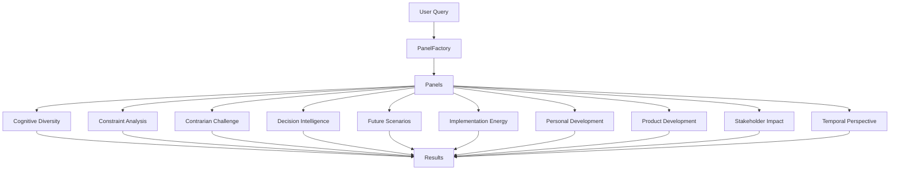

#### Strategic Advisor Architectures

**Custom Architecture**

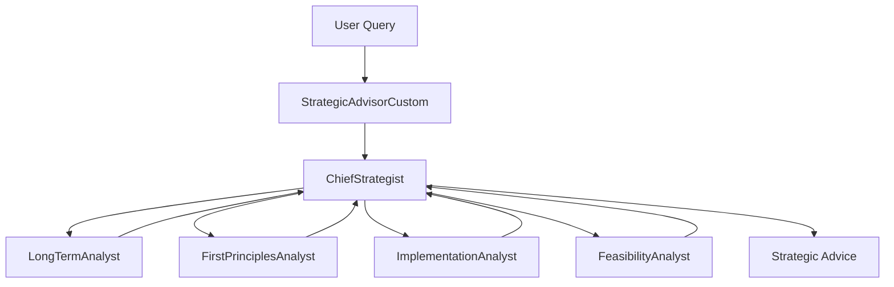

**Swarm Architecture**

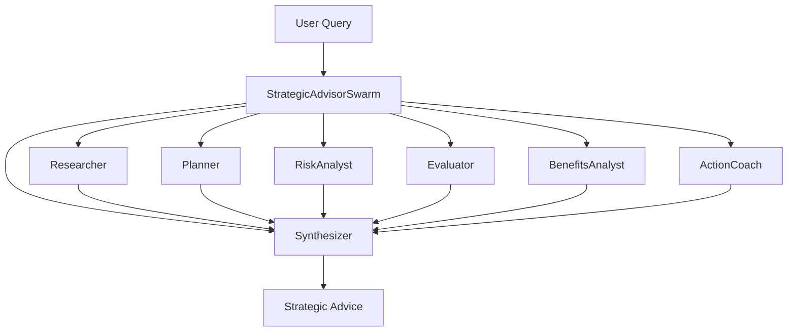

### Individual Panel Workflows

Each panel has its own unique workflow and agent structure:

#### Cognitive Diversity Panel

This panel leverages multiple cognitive styles to analyze problems from different perspectives.

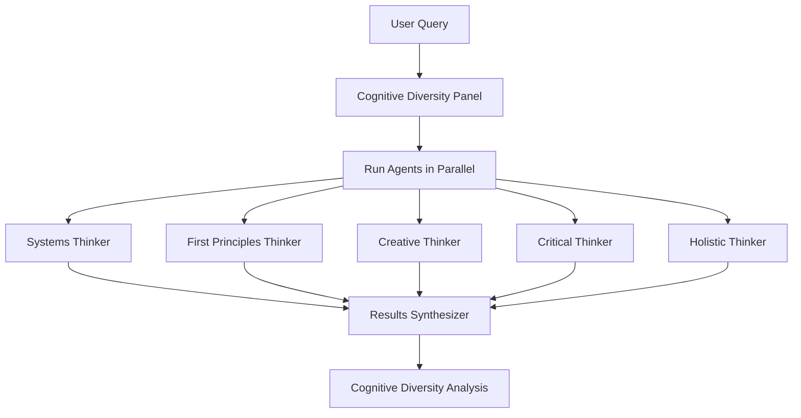

#### Constraint Analysis Panel

This panel identifies and analyzes different types of constraints, turning perceived limitations into opportunities.

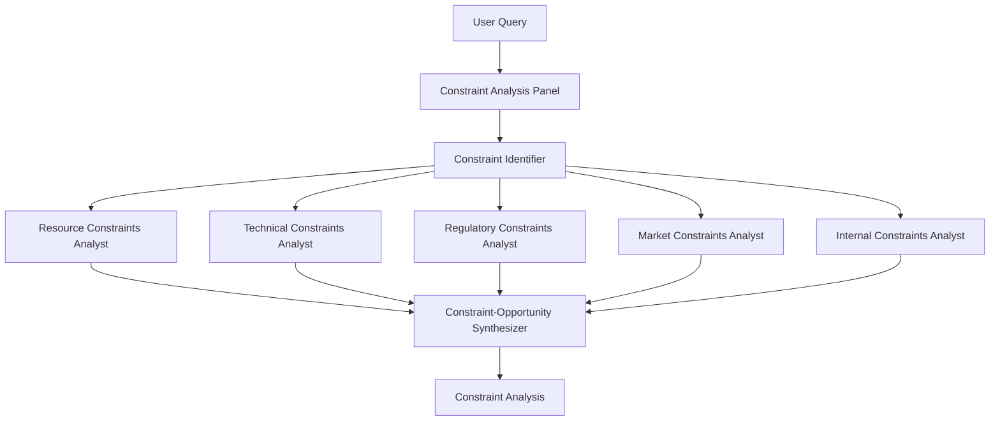

#### Contrarian Challenge Panel

This panel deliberately takes contrary positions to stress-test ideas and uncover blind spots.

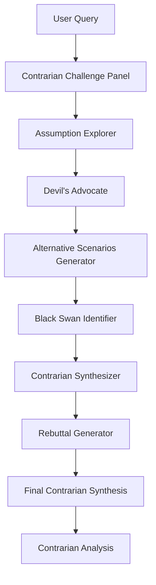

#### Decision Intelligence Panel

This panel applies decision theory to improve decision quality under uncertainty.

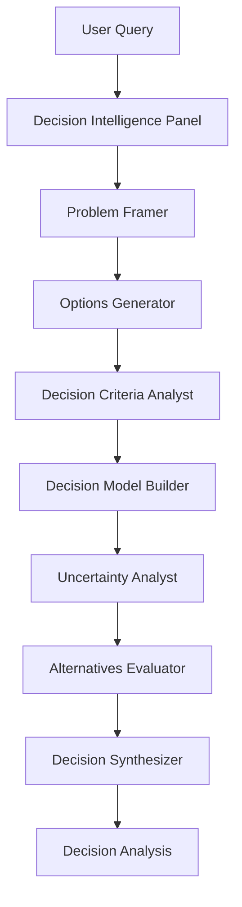

#### Future Scenarios Panel

This panel explores possible futures to build robust plans that work across multiple scenarios.

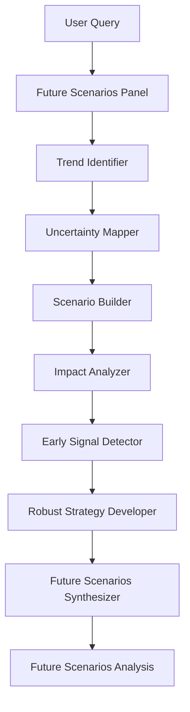

#### Implementation Energy Panel

This panel evaluates how much energy and resources are needed to implement different strategies.

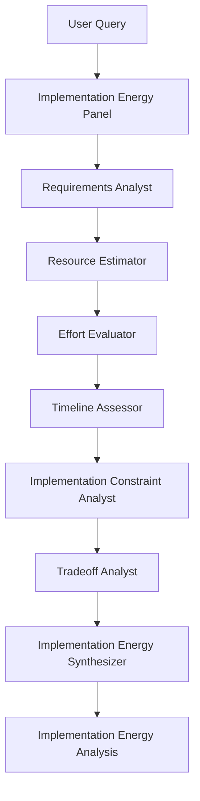

#### Personal Development Panel

This panel provides personalized growth strategies tailored to individual goals and circumstances.

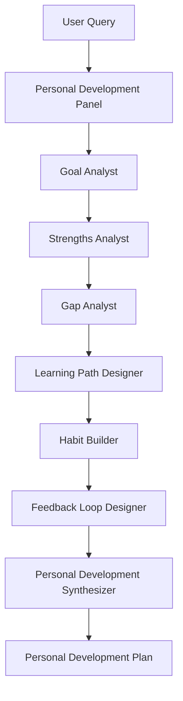

#### Product Development Panel

This panel provides strategies for creating and refining products that meet market needs.

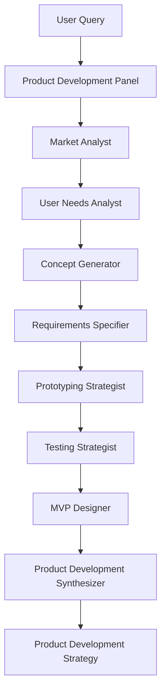

#### Stakeholder Impact Panel

This panel assesses how decisions affect different stakeholders and designs strategies for stakeholder management.

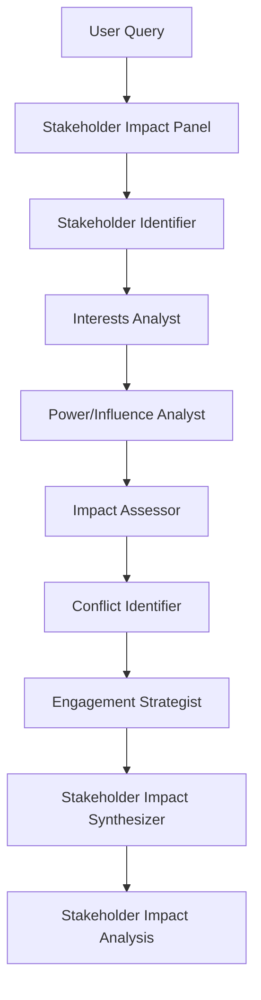

#### Temporal Perspective Panel

This panel analyzes issues across different time horizons to balance short-term and long-term considerations.

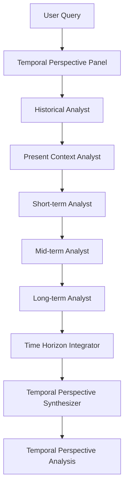

### Strategic Advisor Commands

The tool provides specialized strategic advisor architectures for generating advice:

1. **Swarm Architecture** - Utilizes a swarm of specialized agents to generate strategic advice:

```bash
# Important: Always put your query in quotes to ensure it's captured correctly
panels strat-swarm "What is the best way for me to be more involved in the masjid?" --llm-provider anthropic --api-key your_api_key

# Or using the module directly
python -m iterative_research_tool.cli strat-swarm "What is the best way for me to lose weight?" --llm-provider anthropic --api-key your_api_key

# Save output to a specific file
panels strat-swarm "What is the best way to start a podcast?" --output-file my_advice.json --llm-provider anthropic --api-key your_api_key

# Show detailed agent processing steps, prompts, and responses
panels strat-swarm "How can I improve my leadership skills?" --show-agent-details --llm-provider anthropic --api-key your_api_key
```

2. **Custom Architecture** - Uses a custom-designed architecture for strategic advice:

```bash
# Important: Always put your query in quotes to ensure it's captured correctly
panels strat-custom "How can I improve my public speaking skills?" --llm-provider anthropic --api-key your_api_key

# Or using the module directly
python -m iterative_research_tool.cli strat-custom "How can I improve my public speaking skills?" --llm-provider anthropic --api-key your_api_key

# Show detailed agent processing steps, prompts, and responses
panels strat-custom "How can I improve my public speaking skills?" --show-agent-details --llm-provider anthropic --api-key your_api_key
```

### Viewing Agent Processing Details

To see the detailed processing steps of each agent in the strategic advisor architectures:

```bash
# For the swarm architecture
panels strat-swarm "Your query here" --show-agent-details --llm-provider anthropic --api-key your_api_key

# For the custom architecture
panels strat-custom "Your query here" --show-agent-details --llm-provider anthropic --api-key your_api_key
```

This will show:
- Each agent as it processes the query
- Handoffs between agents
- The prompt used for each agent (when using --show-agent-details with the --verbose flag)
- The response from each agent
- The final assembled response

Using this feature helps you understand how the strategic advice is generated and verify that the agent handoff architecture is functioning correctly.

### Panel-Based Approach (Original)

This is the original method using specialized cognitive panels:

```bash
# Running with a specific panel
python -m iterative_research_tool.cli --panel cognitive-diversity --llm-provider anthropic --api-key your_api_key "Your query here"

# Or using the global command
panels --panel cognitive-diversity --llm-provider anthropic --api-key your_api_key "Your query here"
```

### Troubleshooting Command Issues

If you experience issues with query capture:
- Always enclose your query in quotes: `"Your query here"`
- Place the query in the correct position based on the command you're using
- For `--panel` approach, the query is the last argument
- For `strat-swarm` and `strat-custom`, the query comes immediately after the command

## LLM Provider Configuration

The tool supports multiple LLM providers, each with their own API keys and models:

### Anthropic (Default)
- Environment variable: `ANTHROPIC_API_KEY`
- Default model: `claude-3-7-sonnet-20250219`
- Installation: `pip install anthropic`

### OpenAI
- Environment variable: `OPENAI_API_KEY`
- Default model: `