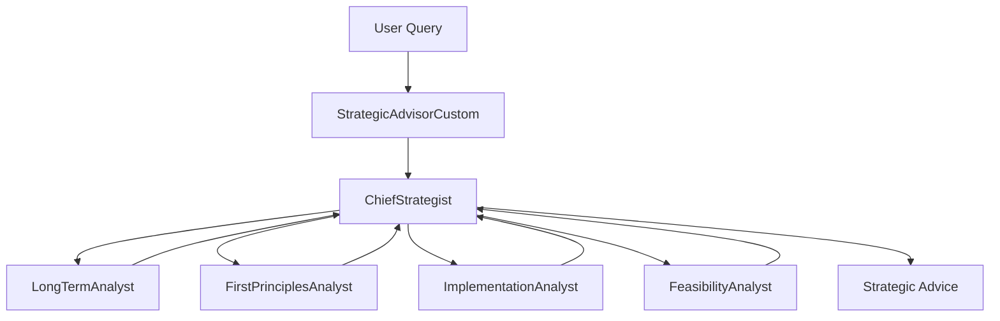
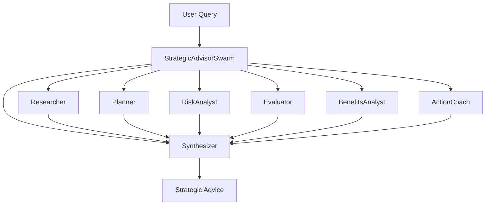

# Multi-Agent Advisory Planner

A powerful CLI tool leveraging specialized AI agent architectures to provide strategic planning and decision-making support.

## Overview

The Multi-Agent Advisory Planner is a comprehensive system that combines specialized AI agents with distinct roles. These agents work together to provide strategic advice, plan complex initiatives, analyze decisions, and explore future scenarios.

Key features:
- Multiple strategic advisor architectures (Swarm, Custom)
- Support for multiple LLM providers (Anthropic, OpenAI, Perplexity)
- Stateful memory across sessions
- Rich visualizations in the terminal
- Comprehensive feedback collection

## Installation

1. Clone the repository:
```bash
git clone https://github.com/yourusername/research_cli_tool.git
cd research_cli_tool
```

2. Install dependencies:

You have several installation options depending on your needs:

```bash
# Basic installation (includes only the Anthropic provider by default)
pip install -e .

# Install with all LLM providers (recommended for most users)
pip install -e ".[all]"

# Complete installation with all providers and development tools
pip install -e ".[complete]"

# Installation with just a specific additional provider
pip install -e ".[openai]"     # For OpenAI
pip install -e ".[perplexity]" # For Perplexity
```

> **Note:** The quotes around ".[all]" are important in some shells (like zsh) to prevent glob expansion.

The recommended option for most users is `pip install -e ".[all]"`, which installs all LLM providers at once, ensuring you won't encounter missing dependency errors when switching between providers.

**LLM Provider Packages:**
- Anthropic: Uses the `anthropic` package
- OpenAI: Uses the `openai` package
- Perplexity: Uses the `PerplexiPy` package

If you ever encounter missing dependencies when running the tool, you can use the `--install-deps` flag to automatically install the required packages for the specified provider:

```bash
iterative_research_tool --llm-provider perplexity --install-deps
```

3. Set up your API keys:
```bash
# For Anthropic (default)
echo "ANTHROPIC_API_KEY=your_api_key_here" > .env

# For OpenAI (optional)
echo "OPENAI_API_KEY=your_api_key_here" >> .env

# For Perplexity (optional)
echo "PERPLEXITY_API_KEY=your_api_key_here" >> .env
```

## Project Structure

The project is organized into the following directories:

- `iterative_research_tool/`: Main package directory
  - `core/`: Core functionality and utilities
  - `strategic_advisor/`: Strategic advisor implementations (custom and swarm architectures)
  - `prompts/`: Prompt templates used by the system
- `tests/`: Test files for the project
- `docs/`: Documentation files

## Usage

### Interactive UI

The tool provides an interactive UI through the `panelsui` command, allowing you to easily select options through a menu-driven interface:

```bash
# Start the interactive UI (recommended for new users)
panelsui
```

The interactive UI guides you through the following steps:
1. Select your approach (Strategic Advisor Custom or Strategic Advisor Swarm)
2. Enter your query
3. Choose the LLM provider (Anthropic, OpenAI, or Perplexity)
4. Choose the specific model
5. Enter your API key (or it will be read from environment variables if available)

This is the easiest way to use the tool as it handles all the command-line parameters for you.

### Available Strategic Advisor Architectures

The tool offers two strategic advisor architectures:

#### Strategic Advisor Architectures

**Custom Architecture**



**Swarm Architecture**



## Custom vs Swarm Architecture: Pros and Cons

### Custom Architecture

**Pros:**
- Highly structured workflow with predetermined agent roles and transitions
- Predictable execution pattern that follows a consistent sequence
- Efficient for well-defined problem domains with established best practices
- Excellent for detailed analysis that requires systematic examination of different aspects
- Easier to debug due to deterministic flow

**Cons:**
- Less flexible for adapting to unexpected aspects of a query
- Fixed workflow may not be optimal for all types of queries
- Limited ability to dynamically allocate more resources to aspects that need deeper analysis
- May generate redundant analysis for simpler queries that don't require all steps

### Swarm Architecture

**Pros:**
- Highly adaptable to different types of queries
- Dynamic agent selection based on query context
- Agents can pass control to the most appropriate next agent
- More efficient for open-ended or exploratory queries
- Can dedicate more computation to complex aspects of a problem

**Cons:**
- Less predictable execution path
- Potential for circular references or suboptimal agent selection
- More complex to debug due to variable execution paths
- May miss important aspects if not explicitly handed off to the right agent

## Strategic Advisor Commands

The tool provides specialized strategic advisor architectures for generating advice:

1. **Swarm Architecture** - Utilizes a swarm of specialized agents to generate strategic advice:

```bash
# Important: Always put your query in quotes to ensure it's captured correctly
python -m iterative_research_tool.cli strat-swarm "What is the best way for me to be more involved in the masjid?" --llm-provider anthropic --api-key your_api_key

# Save output to a specific file
python -m iterative_research_tool.cli strat-swarm "What is the best way to start a podcast?" --output-file my_advice.json --llm-provider anthropic --api-key your_api_key

# Show detailed agent processing steps, prompts, and responses
python -m iterative_research_tool.cli strat-swarm "How can I improve my leadership skills?" --show-agent-details --llm-provider anthropic --api-key your_api_key
```

2. **Custom Architecture** - Uses a custom-designed architecture for strategic advice:

```bash
# Important: Always put your query in quotes to ensure it's captured correctly
python -m iterative_research_tool.cli strat-custom "How can I improve my public speaking skills?" --llm-provider anthropic --api-key your_api_key

# Show detailed agent processing steps, prompts, and responses
python -m iterative_research_tool.cli strat-custom "How can I improve my public speaking skills?" --show-agent-details --llm-provider anthropic --api-key your_api_key
```

### Viewing Agent Processing Details

To see the detailed processing steps of each agent in the strategic advisor architectures:

```bash
# For the swarm architecture
python -m iterative_research_tool.cli strat-swarm "Your query here" --show-agent-details --llm-provider anthropic --api-key your_api_key

# For the custom architecture
python -m iterative_research_tool.cli strat-custom "Your query here" --show-agent-details --llm-provider anthropic --api-key your_api_key
```

This will show:
- Each agent as it processes the query
- Handoffs between agents
- The prompt used for each agent (when using --show-agent-details with the --verbose flag)
- The response from each agent
- The final assembled response

Using this feature helps you understand how the strategic advice is generated and verify that the agent handoff architecture is functioning correctly.

### Troubleshooting Command Issues

If you experience issues with query capture:
- Always enclose your query in quotes: `"Your query here"`
- Place the query in the correct position based on the command you're using
- For `strat-swarm` and `strat-custom`, the query comes immediately after the command

## LLM Provider Configuration

The tool supports multiple LLM providers, each with their own API keys and models:

### Anthropic (Default)
- Environment variable: `ANTHROPIC_API_KEY`
- Default model: `claude-3-7-sonnet-20250219`
- Installation: `pip install anthropic`

### OpenAI
- Environment variable: `OPENAI_API_KEY`
- Default model: `gpt-4`
- Installation: `pip install openai`

### Perplexity
- Environment variable: `PERPLEXITY_API_KEY`
- Default model: `sonar`
- Installation: `pip install perplexity-python`

## Contributing

Contributions are welcome! Please feel free to submit a Pull Request.

## License

This project is open source and available under the [MIT License](LICENSE).